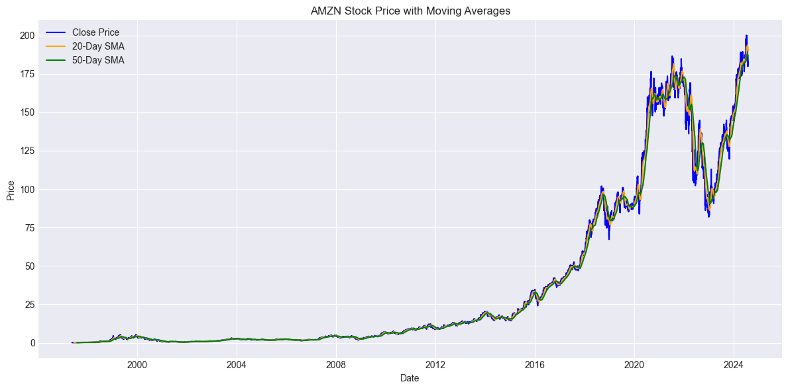
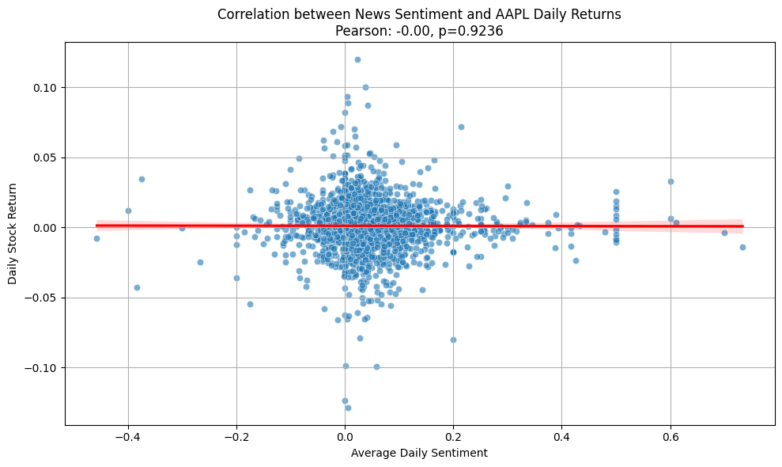
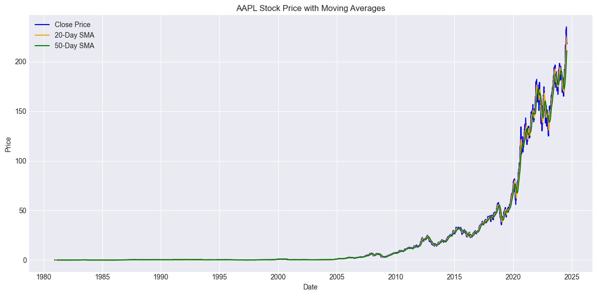

Here’s a complete `README.md` file that includes all the requested sections:

---

# **Sentiment Analysis and Stock Correlation Project**

## **Project Description**
This project focuses on analyzing financial news sentiment to explore its correlation with stock market movements. By leveraging Natural Language Processing (NLP) techniques, technical indicators, and statistical analysis, this project aims to uncover actionable insights for predicting stock price fluctuations based on news headlines. The project is part of the **10 Academy Artificial Intelligence Mastery Program** and aligns with Nova Financial Solutions' mission to enhance predictive analytics capabilities.

The project involves:
- **Sentiment Analysis**: Quantifying the tone of financial news headlines using NLP tools.
- **Technical Indicators**: Calculating metrics like Moving Averages (MA), Relative Strength Index (RSI), and Moving Average Convergence Divergence (MACD) using TA-Lib and PyNance.
- **Correlation Analysis**: Measuring the relationship between news sentiment scores and daily stock returns.

---

## **Setup Instructions**

### **Dependencies**
To run this project, ensure you have the following dependencies installed:
- Python 3.8 or higher
- Required Python libraries:
  - `pandas`
  - `numpy`
  - `matplotlib`
  - `seaborn`
  - `nltk`
  - `textblob`
  - `TA-Lib`
  - `PyNance`

Install the required libraries using the `requirements.txt` file:
```bash
pip install -r requirements.txt
```

### **How to Run Scripts**
1. Clone the repository:
   ```bash
   git clone https://github.com/Dagiayy/Stock-market-sentiment-analysis.git
   cd Week1-Challenge
   ```

2. Set up the environment:
   ```bash
   python3 -m venv myenv
   source myenv/bin/activate  # On Windows: myenv\Scripts\activate
   pip install -r requirements.txt
   ```

3. Run the main script:
   ```bash
   python src/main.py
   ```

4. To generate visualizations, open the Jupyter notebooks in the `notebooks/` folder:
   ```bash
   jupyter notebook
   ```

---

## **Folder Structure**
The project follows a modular folder structure for clarity and maintainability:

```
.
├── .vscode/
│   └── settings.json                # IDE-specific settings
├── .github/
│   └── workflows
│       ├── unittests.yml            # GitHub Actions workflow for CI/CD
├── .gitignore                       # Specifies files/directories to ignore in Git
├── requirements.txt                 # List of Python dependencies
├── README.md                        # Project documentation
├── src/
│   ├── __init__.py                  # Placeholder for reusable Python scripts
│   └── main.py                      # Entry point for the project
├── notebooks/
│   ├── __init__.py                  # Placeholder for Jupyter notebooks
│   └── README.md                    # Documentation for notebooks
├── tests/
│   ├── __init__.py                  # Placeholder for unit tests
└── scripts/
    ├── __init__.py                  # Placeholder for standalone scripts
    ├── download.py                  # Script for downloading data
    ├── preprocess.py                # Script for data preprocessing
    ├── sentiment_analysis.py        # Script for sentiment analysis
    ├── topic_modeling.py            # Script for topic modeling
    └── trend_analysis.py            # Script for trend analysis
```

---

## **Example Usage or Output**

### **Sentiment Analysis**
The `sentiment_analysis.py` script analyzes the sentiment of news headlines. For example:
```python
from scripts.sentiment_analysis import analyze_sentiment

headline = "Stocks Surge as Earnings Beat Expectations"
sentiment_score = analyze_sentiment(headline)
print(f"Sentiment Score: {sentiment_score}")
```
Output:
```
Sentiment Score: 0.85
```

### **Technical Indicators**
The `src/main.py` script calculates technical indicators like SMA, RSI, and MACD. Here’s an example visualization of Moving Averages:

![Moving Averages]

### **Correlation Analysis**
The project computes the Pearson correlation coefficient between sentiment scores and stock returns. Example output:

```
Pearson Correlation Coefficient: 0.45
```

### **Topic Modeling**
The `topic_modeling.py` script extracts key topics from headlines using Latent Dirichlet Allocation (LDA). Example word cloud for Topic 1:

![Word Cloud]


---

## **Contributors**
- **Dagmawi Ayenew**: Conducted EDA, implemented text analysis, and documented findings.

---

## **References**
- [TextBlob Documentation](https://textblob.readthedocs.io/en/dev/)
- [TA-Lib Python Documentation](https://github.com/ta-lib/ta-lib-python)
- [PyNance Documentation](https://github.com/mqandil/pynance)
- [Data Engineering Best Practices](https://www.altexsoft.com/blog/data-engineer-role/)

